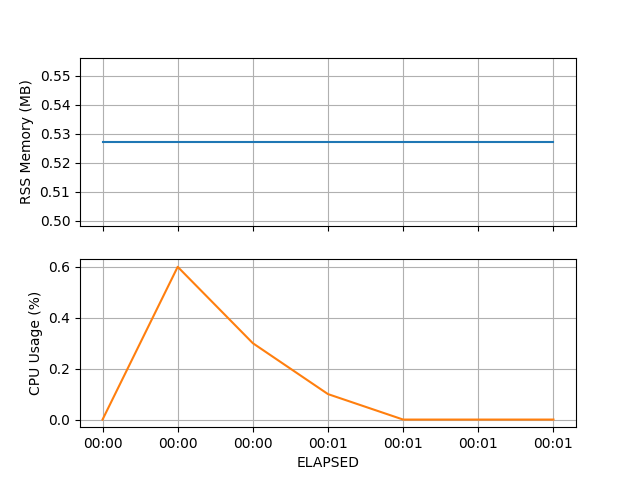

# process-plot

[![Build Status][ci-badge]][ci-link]
[![codecov.io][cov-badge]][cov-link]
[![PyPI version][pypi-badge]][pypi-link]

Create plots of resource usage for a process (memory, CPU, etc).

Process statistics are polled at a set interval, in a cross-platform manner (i.e. supports Linux, OSX and Windows).

## Usage

Install the package with [pip](https://pip.pypa.io) or [pipx](https://github.com/pypa/pipx):

```console
$ pipx install process-plot
```

then run:

```console
$ pplot exec -i 0.1 "sleep 1"
PPLOT INFO: Output files will be written to: /user/pplot_out, with basename: 20210921125420
PPLOT INFO: Running process as PID: 5379
PPLOT INFO: Total run time: 0 hour(s), 00 minute(s), 01.034680 second(s)
PPLOT INFO: Plotting results to: pplot_out/20210921125420.png
PPLOT SUCCESS!
```

You will then find the output files in `/user/pplot_out`, with a plot for the process like:



Additional options are available:

```console
$ pplot exec --help
Usage: pplot exec [OPTIONS] COMMAND

  Execute a command and profile it.

Options:
  -i, --interval FLOAT            Polling interval (seconds)
  -t, --timeout FLOAT             Timeout process (seconds)
  -c, --command-output [hide|screen|file]
                                  Mode for stdout/stderr of command  [default:
                                  file]
  -o, --outfolder DIRECTORY       Folder path for output files
  -n, --basename TEXT             Basename for output files (defaults to
                                  datetime)
  -p, --plot-cols [memory_rss|memory_vms|cpu_percent|cpu_time_user|cpu_time_sys|threads_num|files_num]
                                  Columns to plot (comma-delimited)  [default:
                                  memory_rss,cpu_percent]
  --title TEXT                    Plot title (defaults to command)
  --grid / --no-grid              Add grid to plots  [default: grid]
  -f, --format [png|pdf|svg]      Plot file format
  -v, --verbose                   Increase verbosity  [x>=0]
  -q, --quiet                     Quiet mode
  --help                          Show this message and exit.
```

## Acknowledgements

Initially adapted from: <https://github.com/jeetsukumaran/Syrupy>

[ci-badge]: https://github.com/chrisjsewell/process-plot/workflows/CI/badge.svg?branch=main
[ci-link]: https://github.com/chrisjsewell/process-plot/actions?query=workflow%3ACI+branch%3Amain+event%3Apush
[cov-badge]: https://codecov.io/gh/chrisjsewell/process-plot/branch/main/graph/badge.svg
[cov-link]: https://codecov.io/gh/chrisjsewell/process-plot
[pypi-badge]: https://img.shields.io/pypi/v/process-plot.svg
[pypi-link]: https://pypi.org/project/process-plot
