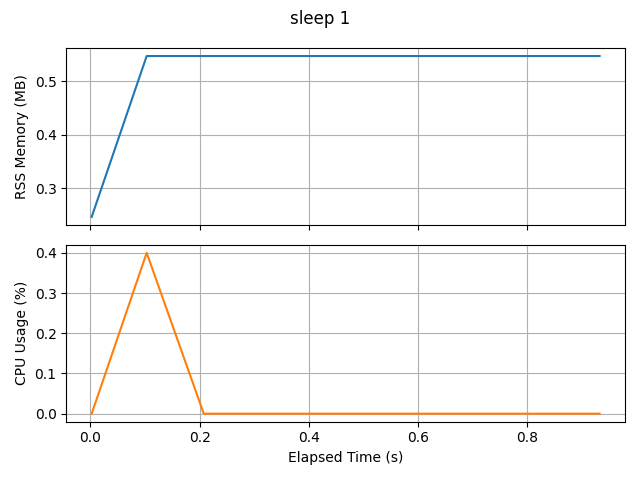

# process-plot

Create plots of memory and CPU usage for a process.

This is a wrapper around the [ps](https://man7.org/linux/man-pages/man1/ps.1.html) command,
which polls it at a set interval.

## Usage

Install the package with [pip](https://pip.pypa.io) or [pipx](https://github.com/pypa/pipx):

```console
$ pipx install process-plot
```

then run:

```console
$ pplot exec -i 0.1 "sleep 1"
PPLOT INFO: Output files will be written to: /user/pplot_out, with basename: 20210921024614
PPLOT INFO: Running process
PPLOT INFO: Total run time: 0 hour(s), 00 minute(s), 01.175246 second(s)
PPLOT INFO: Plotting results
PPLOT SUCCESS!
```

You will then find the output files in `/user/pplot_out`, with a plot for the process like:



## Acknowledgements

Initially adapted from: <https://github.com/jeetsukumaran/Syrupy>
