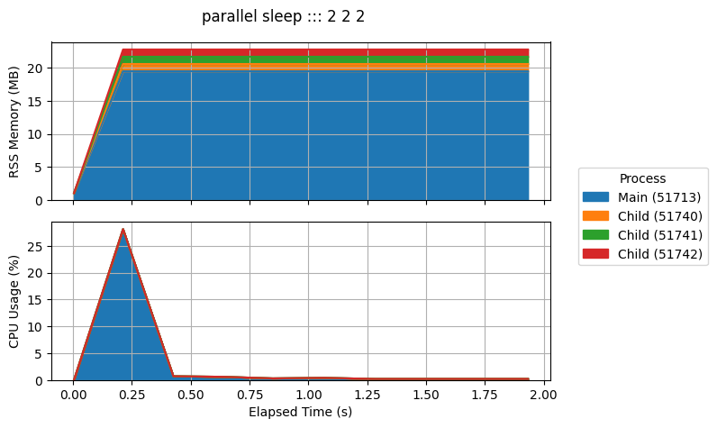

# process-plot

[![codecov.io][cov-badge]][cov-link]
[![PyPI version][pypi-badge]][pypi-link]

Create plots of resource usage for a process (memory, CPU, etc).

Process statistics are polled at a set interval, in a cross-platform manner (i.e. supports Linux, OSX and Windows).

Information is collected on both the main process and any child processes, and can be plotted in a single graph.

## Usage

Install the package with [pip](https://pip.pypa.io) or [pipx](https://github.com/pypa/pipx):

```console
$ pipx install process-plot
```

then run:

```console
$ pplot exec "sleep 1" -i 0.1
PPLOT INFO: Output files will be written to: /user/pplot_out, with basename: 20210921125420
PPLOT INFO: Running process as PID: 5379
PPLOT INFO: Total run time: 0 hour(s), 00 minute(s), 01.034680 second(s)
PPLOT INFO: Plotting results to: pplot_out/20210921125420.png
PPLOT SUCCESS!
```

You will then find the output files in `/user/pplot_out`, with a plot for the process like:


If the process spawns child processes, by default, the values for the main process and all child processes are summed together.
When called with `--stack-processes`, the plot will stack the values per process:

```console
$ pplot exec "parallel sleep ::: 2 2 2" -i 0.2 --stack-processes --legend
```



Additional options are available:

```console
$ pplot exec --help

 Usage: pplot exec [OPTIONS] COMMAND

 Execute a command and profile it.

╭─ Arguments ───────────────────────────────────────────────────────────────────────────────────────────────────╮
│ *    command      TEXT  [default: None] [required]                                                            │
╰───────────────────────────────────────────────────────────────────────────────────────────────────────────────╯
╭─ Options ─────────────────────────────────────────────────────────────────────────────────────────────────────╮
│ --interval        -i                FLOAT               Polling interval (seconds) [default: 1]               │
│ --timeout         -t                FLOAT               Timeout process (seconds)                             │
│ --child               --no-child                        Collect child process data [default: child]           │
│ --command-output  -c                [hide|screen|file]  Mode for stdout/stderr of command [default: file]     │
│ --outfolder       -o                DIRECTORY           Folder path for output files [default: pplot_out]     │
│ --basename        -n                TEXT                Basename for output files (defaults to datetime)      │
│ --quiet           -q                                    Quiet mode                                            │
│ --help            -h                                    Show this message and exit.                           │
╰───────────────────────────────────────────────────────────────────────────────────────────────────────────────╯
╭─ Plot ────────────────────────────────────────────────────────────────────────────────────────────────────────╮
│ --plot-cols        -p                           COMMA-DELIMITED  Columns to plot                              │
│                                                                  [default: memory_rss, cpu_percent]           │
│ --stack-processes       --no-stack-processes                     Stack values per process in plot             │
│                                                                  [default: no-stack-processes]                │
│ --title                                         TEXT             Plot title (defaults to command)             │
│ --grid                  --no-grid                                Add grid to plots [default: grid]            │
│ --legend                --no-legend                              Add legend to figure [default: no-legend]    │
│ --size-width       -sw                          FLOAT            Width of plot in cm [default: None]          │
│ --size-height      -sh                          FLOAT            Height of plot in cm [default: None]         │
│ --format           -f                           [png|pdf|svg]    Plot file format [default: png]              │
╰───────────────────────────────────────────────────────────────────────────────────────────────────────────────╯

```

## Acknowledgements

Initially adapted from: <https://github.com/jeetsukumaran/Syrupy>

[ci-badge]: https://github.com/chrisjsewell/process-plot/workflows/CI/badge.svg?branch=main
[ci-link]: https://github.com/chrisjsewell/process-plot/actions?query=workflow%3ACI+branch%3Amain+event%3Apush
[cov-badge]: https://codecov.io/gh/chrisjsewell/process-plot/branch/main/graph/badge.svg
[cov-link]: https://codecov.io/gh/chrisjsewell/process-plot
[pypi-badge]: https://img.shields.io/pypi/v/process-plot.svg
[pypi-link]: https://pypi.org/project/process-plot
